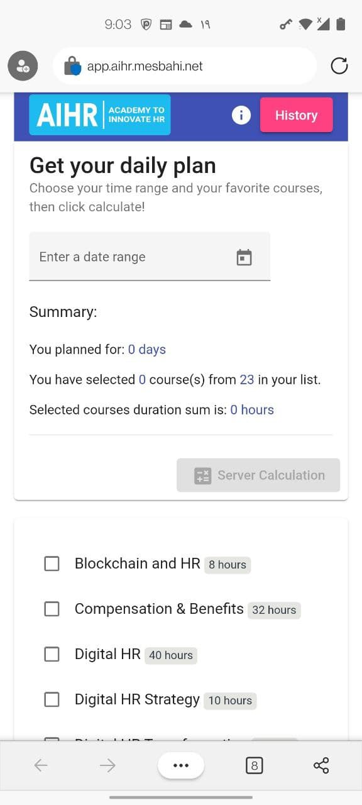

# About Codes

#### [Live Demo (Application) ](https://app.aihr.mesbahi.net/)
#### [Live Demo (Swagger, Backend API) ](https://backend.aihr.mesbahi.net/swagger/index.html)
---

> All requested features and specifications mentioned in assignment done.<br>Also, the live version deployed for testing the project easier.<br>The project was designed and developed according to the 3 hours development limitation rule.
---
## **Front**
---
> I developed the frontend using Angular+Angular Material 13.1.1<br> The **Calculation Button** is disabed till **entering date range** and **choosing some courses from the list**.<br>Also, **the history** of all calcualtions can be accessed using [history link](https://app.aihr.mesbahi.net/history/).

```
$ npm install
$ ng serve
```


---


---



---

## **Backend API**
---
> I developed the backend microservice using .NET 6<br> Also, a few unit tests were developed for testing the calculation.

```
dotnet ef migrations add "InitDatatbase" -o "Data/Migrations" -c "WorkloadCalculatorDbContext" -p ./src/AIHR.WorkloadCalculator.Service/AIHR.WorkloadCalculator.Service.csproj


dotnet ef database update  -c "WorkloadCalculatorDbContext" -p ./src/AIHR.WorkloadCalculator.Service/AIHR.WorkloadCalculator.Service.csproj

dotnet run
```


# Coding Assignment

The goal of this assignment is to create a Workload Calculator. With the microservice, the end-user can select which courses from our curriculum they want to take and they’ll get their workload (expected study hours per week) to finish theirlearning journey on time.

## Instructions:

* You can use any of the following programming languages: C#, NodeJS, or Python.

* An interface (UI) is required, but we are not looking for a perfect designed UI/UX front end, if you are more comfortable with a console app, use that instead

  

## Specs:

* Create a list of courses that shows the course's name and duration (in hours) where the user can multi-select which one they wish to take (see below the list of courses and their respective completion hours)

* Create a form where the user can select Start and End dates

* Create a Calculate button

* The final output needs to show how many hours the student needs to study per week to complete all selected courses afterthey click the Calculate button

* The list of selected courses, the Start and End dates, and the finalresult needs to be stored in a database

* Display the usage history forthe calculator based on the student's inputs